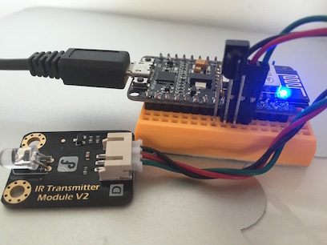
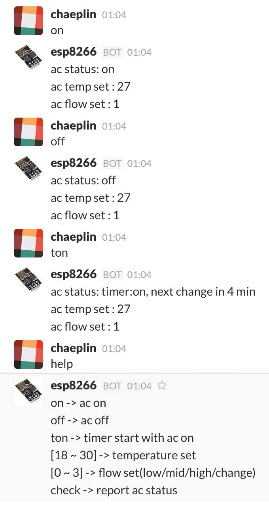
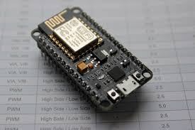
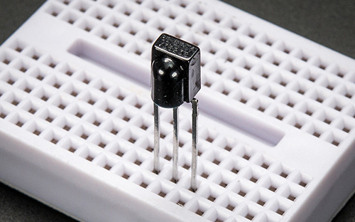
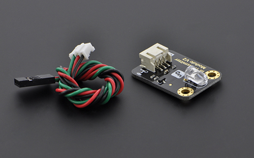

esp8266 + slackbot으로 LG 휘센 에어콘 콘트롤
===================================

esp8266과 slack rtm bot api를 이용하여 인터넷으로 에어콘 조정




## 기능
- 에어콘 켜기, 끄기
- 타이머로 켜고 끄기 반복
- 온도 설정
- 바람 세기 설정
- 동작시 상태 보고
- 에어콘 전용 리모트로 조정시, 온도/바람세기/온/오프 디코딩하여 상태 반영 및 보고

## 명령
- help
```
on -> ac on
off -> ac off
ton -> timer start with ac on
[18 ~ 30] -> temperature set
[0 ~ 3] -> flow set(low/mid/high/change)
check -> report ac status
```

## 단점
- IR 인코딩/디코딩용 lgWhisen 라이브러리가 LG 휘센 전용(우리집이 휘센만 있어요..)

## rtm slackbot
- based on Uri Shaked's Arduino Real-Time Slack Bot [https://github.com/urish/arduino-slack-bot](https://github.com/urish/arduino-slack-bot)

## 스케치
[https://github.com/chaeplin/lgwhisen/blob/master/examples/slackbot/slackbot.ino](https://github.com/chaeplin/lgwhisen/blob/master/examples/slackbot/slackbot.ino)

### 준비물
- esp8266. 편의상 nodemcu 사용
- IR RX : TSOP38238 // https://learn.adafruit.com/ir-sensor
- IR TX : IR LED(38KHz)

nodemcu | ir rx | ir tx
--------|-------|--------
 |  | 

### 라이브러리
- WebSocketsClient : [https://github.com/Links2004/arduinoWebSockets](https://github.com/Links2004/arduinoWebSockets)
- ArduinoJson : [https://github.com/bblanchon/ArduinoJson](https://github.com/bblanchon/ArduinoJson)
- lgWhisen : [https://github.com/chaeplin/lgwhisen](https://github.com/chaeplin/lgwhisen)
- IRremoteESP8266 : [https://github.com/markszabo/IRremoteESP8266](https://github.com/markszabo/IRremoteESP8266)

### 연결
- RX : TSOP38238의 out을 D5/GPIO14에 연결
- TX : IR LED의 +또는 SIG 라인을 D4/GPIO2에 연결

### 스케치 설정
- slackbot api token 준비
```
#define WIFI_SSID       "wifi-name"
#define WIFI_PASSWORD   "wifi-password"
#define OTA_PASSWORD    "ota-password"

// https://api.slack.com/bot-users
#define SLACK_BOT_TOKEN "put-your-slack-token-here"
```
- 슬랙 채널, 팀, 유저는 스케치 업로드하여 슬랙 연결 확인된후, 연결된 봇에 메세지 보내서 아두이노 시리얼 모니터에서 확인후 변경
```
// sned a msg to bot using slack app or web.
// check Arduino serial monitor, channel, user and team cam be found 
#define SLACK_CHANNEL "xxxxxx"
#define SLACK_USER "xxxxxxx"
#define SLACK_TEAM "xxxxxx"

```
- 에어콘 종류 및 타이머온/오프타임 설정 
```
#define IR_RX_PIN 14 
#define IR_TX_PIN 2
#define AC_CONF_TYPE 1      // 0 : 거실 타워형, 1: 벽결이형
#define AC_CONF_HEATING 0   // 0 : 냉방, 1 : 난방(외국은...)
#define AC_CONF_ON_MIN 30   // 켜기 지속시간 / 분
#define AC_CONF_OFF_MIN 20  // 끄기 지속시간 / 분
// 예) 30분 켜고 20분 끄고 반복
```
- 에어콘 기본 온도/바람세기
```
  ir_data.ac_temp     = 27; // 온도
  ir_data.ac_flow     = 1;  // 바람세기, 0 : 약, 1 : 중, 2 : 강, 벽걸이형인 경우 3 : 약중강 변화 
```


* 참고 휘센 IR 디코딩 : [https://github.com/chaeplin/lgwhisen/blob/master/decoding.md](https://github.com/chaeplin/lgwhisen/blob/master/decoding.md)
